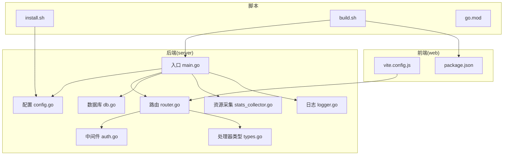
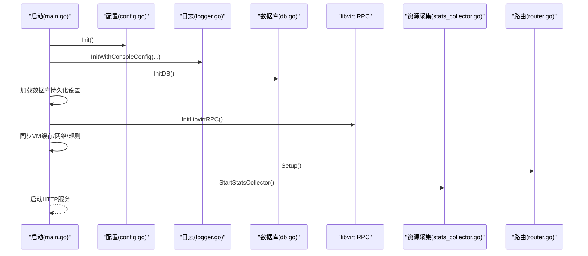
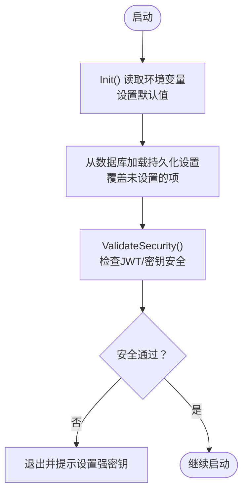
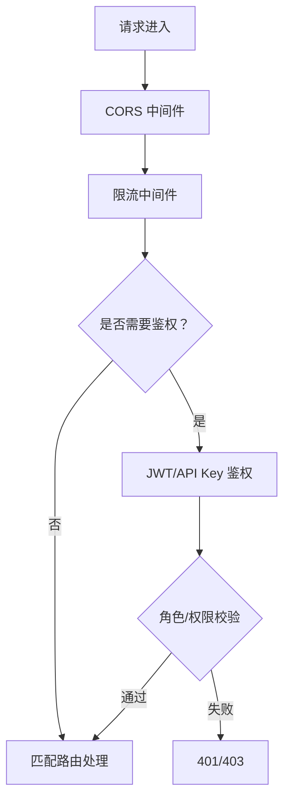
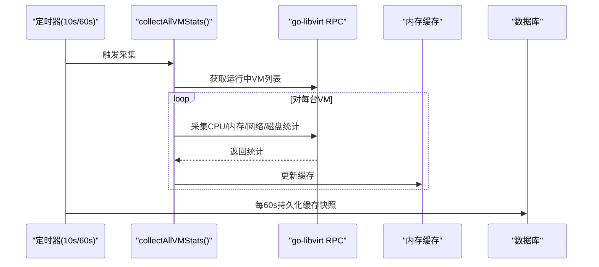
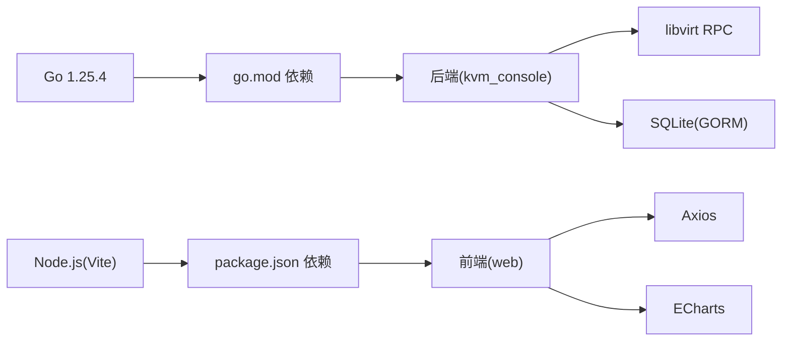

# 部署与运维

<cite>
**本文引用的文件**
- [server/main.go](file://server/main.go)
- [server/config/config.go](file://server/config/config.go)
- [server/router/router.go](file://server/router/router.go)
- [server/model/db.go](file://server/model/db.go)
- [server/service/host/stats_collector.go](file://server/service/host/stats_collector.go)
- [server/logger/logger.go](file://server/logger/logger.go)
- [server/middleware/auth.go](file://server/middleware/auth.go)
- [server/handler/types.go](file://server/handler/types.go)
- [install.sh](file://install.sh)
- [build.sh](file://build.sh)
- [server/go.mod](file://server/go.mod)
- [web/package.json](file://web/package.json)
- [web/vite.config.js](file://web/vite.config.js)
</cite>

## 目录
1. [简介](#简介)
2. [项目结构](#项目结构)
3. [核心组件](#核心组件)
4. [架构总览](#架构总览)
5. [详细组件分析](#详细组件分析)
6. [依赖分析](#依赖分析)
7. [性能考虑](#性能考虑)
8. [故障排查指南](#故障排查指南)
9. [结论](#结论)
10. [附录](#附录)

## 简介
本指南面向生产环境的 Open 虚拟机管理控制台（QVMConsole）部署与运维，涵盖系统要求、依赖安装、配置设置、容器化部署方案（Docker 与 Kubernetes）、监控告警配置、备份与恢复策略、性能优化建议以及常见问题排查与故障恢复流程。文档基于仓库源码进行梳理，确保内容与实现一致。

## 项目结构
- 后端（Go）位于 server/，包含配置、路由、中间件、数据库模型、服务层、任务队列、日志与工具模块。
- 前端（Vue 3）位于 web/，通过 Vite 构建，开发时通过代理转发 /api 到后端。
- 安装与打包脚本位于根目录，提供一键安装、升级、卸载与构建发布包的能力。

**图表来源**
- [server/main.go:1-128](file://server/main.go#L1-L128)
- [server/config/config.go:154-249](file://server/config/config.go#L154-L249)
- [server/router/router.go:18-485](file://server/router/router.go#L18-L485)
- [server/model/db.go:54-113](file://server/model/db.go#L54-L113)
- [server/service/host/stats_collector.go:33-73](file://server/service/host/stats_collector.go#L33-L73)
- [server/logger/logger.go:31-84](file://server/logger/logger.go#L31-L84)
- [server/middleware/auth.go:75-199](file://server/middleware/auth.go#L75-L199)
- [server/handler/types.go:9-59](file://server/handler/types.go#L9-L59)
- [install.sh:19-565](file://install.sh#L19-L565)
- [build.sh:21-182](file://build.sh#L21-L182)
- [server/go.mod:1-51](file://server/go.mod#L1-L51)
- [web/vite.config.js:1-27](file://web/vite.config.js#L1-L27)
- [web/package.json:1-30](file://web/package.json#L1-L30)

**章节来源**
- [server/main.go:1-128](file://server/main.go#L1-L128)
- [server/router/router.go:18-485](file://server/router/router.go#L18-L485)
- [install.sh:19-565](file://install.sh#L19-L565)
- [build.sh:21-182](file://build.sh#L21-L182)
- [web/vite.config.js:1-27](file://web/vite.config.js#L1-L27)
- [web/package.json:1-30](file://web/package.json#L1-L30)

## 核心组件
- 配置系统：集中于全局配置结构体与环境变量映射，支持从数据库持久化覆盖与 .env 同步。
- 路由与中间件：基于 Gin，提供 CORS、限流、鉴权、管理员与 VM 访问控制等。
- 数据库：SQLite，自动迁移与兼容性修复，初始化默认管理员。
- 资源采集：后台定时采集 VM/宿主机资源，内存缓存 + 定期落库。
- 日志系统：多通道日志（应用、请求、命令、libvirt），支持按级别与终端输出类型控制。
- 安装与打包：一键安装脚本补齐依赖、服务、目录与 OVS 网络地基；构建脚本打包前后端产物。

**章节来源**
- [server/config/config.go:19-152](file://server/config/config.go#L19-L152)
- [server/config/config.go:318-386](file://server/config/config.go#L318-L386)
- [server/router/router.go:18-485](file://server/router/router.go#L18-L485)
- [server/middleware/auth.go:75-199](file://server/middleware/auth.go#L75-L199)
- [server/model/db.go:54-113](file://server/model/db.go#L54-L113)
- [server/service/host/stats_collector.go:33-73](file://server/service/host/stats_collector.go#L33-L73)
- [server/logger/logger.go:31-84](file://server/logger/logger.go#L31-L84)
- [install.sh:265-327](file://install.sh#L265-L327)
- [build.sh:96-145](file://build.sh#L96-L145)

## 架构总览
后端启动流程：初始化配置 → 日志 → 数据库 → go-libvirt 连接 → 缓存与网络恢复 → 注册任务处理器 → 启动资源采集与定时任务 → 设置路由并启动 HTTP 服务。

**图表来源**
- [server/main.go:39-128](file://server/main.go#L39-L128)
- [server/config/config.go:157-249](file://server/config/config.go#L157-L249)
- [server/logger/logger.go:44-84](file://server/logger/logger.go#L44-L84)
- [server/model/db.go:57-113](file://server/model/db.go#L57-L113)
- [server/service/host/stats_collector.go:33-73](file://server/service/host/stats_collector.go#L33-L73)
- [server/router/router.go:18-485](file://server/router/router.go#L18-L485)

## 详细组件分析

### 配置系统与环境变量
- 全局配置结构体包含端口、数据库路径、JWT 密钥、网络后端、OVS 桥、带宽限制、模板/ISO/克隆目录、日志、动态内存调度、VPC 等。
- 支持从环境变量注入，若未设置则采用默认值；数据库持久化设置可覆盖环境变量。
- 安全检查：禁止使用默认 JWT 密钥（开发模式除外），否则拒绝启动；建议为不同用途设置独立密钥。

**图表来源**
- [server/config/config.go:157-249](file://server/config/config.go#L157-L249)
- [server/config/config.go:251-283](file://server/config/config.go#L251-L283)

**章节来源**
- [server/config/config.go:19-152](file://server/config/config.go#L19-L152)
- [server/config/config.go:318-386](file://server/config/config.go#L318-L386)
- [server/config/config.go:458-677](file://server/config/config.go#L458-L677)
- [server/config/config.go:756-800](file://server/config/config.go#L756-L800)

### 路由与鉴权中间件
- 路由组划分清晰：公开设置、认证、系统设置（管理员）、需要登录的业务路由、任务队列、调度事件中心等。
- 中间件：CORS、全局限流、JWT 鉴权、管理员校验、VM 访问控制、轻量云限制等。
- 鉴权支持 Bearer Token 与 API Key 两种方式，API Key 通过特定 Header 传递。

**图表来源**
- [server/router/router.go:23-485](file://server/router/router.go#L23-L485)
- [server/middleware/auth.go:75-199](file://server/middleware/auth.go#L75-L199)

**章节来源**
- [server/router/router.go:18-485](file://server/router/router.go#L18-L485)
- [server/middleware/auth.go:75-199](file://server/middleware/auth.go#L75-L199)

### 数据库与模型
- 使用 SQLite，自动迁移与兼容性修复，包括用户端口转发配额、快照配额、轻量云配额、VPC CIDR 等。
- 初始化默认管理员账号，密码经 bcrypt 哈希存储。
- 提供资源历史记录的持久化与查询接口。

**章节来源**
- [server/model/db.go:54-113](file://server/model/db.go#L54-L113)
- [server/model/db.go:115-313](file://server/model/db.go#L115-L313)

### 资源采集与监控
- 后台定时采集运行中 VM 与宿主机资源，10 秒采集一次，60 秒持久化一次。
- 内存缓存用于列表接口快速读取，支持查询历史记录。
- 采集内容包括 CPU 百分比、内存、网络收发字节、磁盘读写字节等。

**图表来源**
- [server/service/host/stats_collector.go:33-73](file://server/service/host/stats_collector.go#L33-L73)
- [server/service/host/stats_collector.go:85-124](file://server/service/host/stats_collector.go#L85-L124)
- [server/service/host/stats_collector.go:259-306](file://server/service/host/stats_collector.go#L259-L306)

**章节来源**
- [server/service/host/stats_collector.go:33-73](file://server/service/host/stats_collector.go#L33-L73)
- [server/service/host/stats_collector.go:259-306](file://server/service/host/stats_collector.go#L259-L306)

### 日志系统
- 多通道日志：app、request、cmd、libvirt，支持按级别与终端输出类型控制。
- 支持按天滚动、压缩、最大备份数与大小限制。
- 可独立设置终端输出级别，便于调试与生产环境分离。

**章节来源**
- [server/logger/logger.go:31-84](file://server/logger/logger.go#L31-L84)
- [server/logger/logger.go:172-210](file://server/logger/logger.go#L172-L210)

### 安装与打包脚本
- install.sh：检测架构与 KVM 硬件虚拟化、安装依赖、启用核心服务、准备用户存储配额、生成 .env、补齐目录与权限、准备 OVS 网络地基。
- build.sh：安装前端依赖并构建，编译后端二进制，复制静态资源与安装脚本，打包为 tar.gz。

**更新** 新增对 STORAGE_MOUNT 环境变量的支持，允许用户自定义存储挂载点，并增强了 AppArmor 存储访问权限配置

**章节来源**
- [install.sh:126-146](file://install.sh#L126-L146)
- [install.sh:265-327](file://install.sh#L265-L327)
- [install.sh:347-423](file://install.sh#L347-L423)
- [install.sh:477-565](file://install.sh#L477-L565)
- [install.sh:627-680](file://install.sh#L627-L680)
- [build.sh:96-145](file://build.sh#L96-L145)

## 依赖分析
- 后端依赖：gin、jwt、websocket、libvirt RPC、sqlite、日志轮转等。
- 前端依赖：Vue 3、Element Plus、Axios、ECharts、xterm 等。
- 构建与运行：Go 1.25.4、Node.js（Vite 构建）、系统服务（libvirtd、openvswitch-switch、ssh）。

**图表来源**
- [server/go.mod:1-51](file://server/go.mod#L1-L51)
- [web/package.json:11-28](file://web/package.json#L11-L28)

**章节来源**
- [server/go.mod:1-51](file://server/go.mod#L1-L51)
- [web/package.json:11-28](file://web/package.json#L11-L28)

## 性能考虑
- 资源采集：10 秒一次的频率对运行中 VM 进行统计，60 秒持久化，兼顾实时性与开销。
- I/O 与网络：支持磁盘 IOPS 限制与带宽限制配置，结合动态内存调度减少资源争用。
- 存储：用户存储使用 Project Quota 的 ext4 镜像，支持稀疏文件与配额控制。
- 前端：SPA 回退与静态资源服务，开发时通过代理转发 /api，生产环境由后端提供静态文件。

**章节来源**
- [server/service/host/stats_collector.go:33-73](file://server/service/host/stats_collector.go#L33-L73)
- [server/config/config.go:132-139](file://server/config/config.go#L132-L139)
- [install.sh:347-423](file://install.sh#L347-L423)
- [web/vite.config.js:14-26](file://web/vite.config.js#L14-L26)

## 故障排查指南
- 启动失败（JWT 默认密钥）：检查安全检查逻辑与 .env 中的 KVM_JWT_SECRET 设置。
- libvirt 连接失败：检查 libvirtd 服务状态与 go-libvirt RPC 初始化。
- 日志定位：根据日志通道（app/request/cmd/libvirt）与级别筛选问题；关注慢查询与错误日志。
- 网络问题：检查 OVS 桥、DHCP、iptables 规则与 DNSMASQ；使用安装脚本修复网络地基。
- 资源采集异常：确认运行中 VM 列表获取与统计接口调用是否成功。

**章节来源**
- [server/config/config.go:251-283](file://server/config/config.go#L251-L283)
- [server/main.go:67-71](file://server/main.go#L67-L71)
- [server/logger/logger.go:31-84](file://server/logger/logger.go#L31-L84)
- [install.sh:745-785](file://install.sh#L745-L785)

## 结论
本指南提供了从系统要求、安装部署、配置管理、容器化方案、监控告警、备份恢复到性能优化与故障排查的完整运维路径。建议在生产环境中严格设置密钥与访问控制，启用合适的日志级别与轮转策略，并结合资源采集与带宽/IOPS 限制实现稳定高效的虚拟化平台。

## 附录

### 生产环境部署步骤
- 系统要求与依赖
  - 架构：x86_64
  - 操作系统：Debian/Ubuntu
  - KVM 硬件虚拟化开启
  - 核心服务：libvirtd、openvswitch-switch、ssh
  - 依赖包：qemu、libvirt、ovs、dnsmasq、nftables、iproute2、iptables、tcpdump、nmap、arp-scan、conntrack、util-linux、parted 等
- 安装
  - 使用 install.sh 完成依赖安装、服务启用、目录补齐、OVS 地基准备、用户存储配额初始化与 .env 生成
  - 首次运行后，面板会创建默认管理员账号
- 配置
  - 通过环境变量或 .env 覆盖默认配置；数据库持久化设置可覆盖未设置的项
  - 安全检查：禁止使用默认 JWT 密钥，建议为不同用途设置独立密钥
  - **新增** STORAGE_MOUNT 环境变量支持：允许用户自定义用户存储挂载点，默认为 /var/lib/kvm-user-storage
- 启动
  - 后端启动后自动完成数据库迁移、缓存同步、网络恢复与定时任务启动
  - 前端静态资源由后端提供（生产环境）

**更新** 新增 STORAGE_MOUNT 环境变量支持，允许用户自定义存储挂载点

**章节来源**
- [install.sh:126-146](file://install.sh#L126-L146)
- [install.sh:265-327](file://install.sh#L265-L327)
- [install.sh:347-423](file://install.sh#L347-L423)
- [install.sh:477-565](file://install.sh#L477-L565)
- [install.sh:627-680](file://install.sh#L627-L680)
- [server/config/config.go:157-249](file://server/config/config.go#L157-L249)
- [server/config/config.go:251-283](file://server/config/config.go#L251-L283)
- [server/main.go:39-128](file://server/main.go#L39-L128)

### 容器化部署方案
- Docker 镜像构建
  - 基于 Go 与 Node 环境，先构建前端（npm ci + build），再编译后端（CGO_ENABLED=1 go build），最后打包为最小镜像
  - 建议将 /opt/kvm-console/.env、/var/lib/libvirt/images、/var/lib/kvm-user-storage 等目录挂载为卷
  - **新增** 支持通过环境变量 CUSTOM_STORAGE_MOUNT 覆盖 STORAGE_MOUNT 默认值
- Kubernetes 部署
  - 使用 Deployment + Service 暴露端口
  - 使用 PersistentVolume/PersistentVolumeClaim 管理存储
  - 使用 DaemonSet/HostPath 挂载 /dev/kvm、/var/lib/libvirt/images 等
  - 使用 initContainer 或安装脚本逻辑在 Pod 启动时补齐目录与权限
  - 通过 ConfigMap/Secret 管理 .env 与证书

**更新** 新增对自定义存储挂载点的容器化支持

[本节为概念性部署建议，不直接对应具体源码文件]

### 监控告警配置
- 关键指标
  - VM/CPU 使用率、内存使用、网络收发字节、磁盘读写字节
  - 宿主机 CPU/内存/网络/磁盘
  - 端口转发规则状态、公网 IP 绑定状态、VPC 交换机与安全组
- 告警规则建议
  - CPU 使用率持续超过阈值（如 80%）持续 N 分钟
  - 内存使用率超过阈值（如 85%）
  - 磁盘空间剩余低于阈值（如 10%）
  - 网络带宽利用率超过阈值
  - libvirt 连接失败或统计接口异常
- 日志与审计
  - 启用 app/request/cmd/libvirt 日志通道，按需调整终端输出级别
  - 定期导出与归档日志，保留历史资源记录

**章节来源**
- [server/service/host/stats_collector.go:33-73](file://server/service/host/stats_collector.go#L33-L73)
- [server/logger/logger.go:31-84](file://server/logger/logger.go#L31-L84)

### 备份与恢复策略
- 数据库备份
  - SQLite 文件即为数据库，定期复制 /opt/kvm-console/data/kvm_console.db
  - 建议结合 WAL/事务一致性与归档策略
- 配置文件备份
  - .env 文件位于 /opt/kvm-console/.env，定期备份
  - 可通过配置界面导出日志与设置（如适用）
- 虚拟机快照管理
  - 使用内置快照创建/恢复/删除任务
  - 建议为关键业务 VM 周期性创建快照并验证恢复流程
- 存储备份
  - 用户存储镜像与挂载点定期快照或备份
  - 验证 Project Quota 与配额策略一致性
  - **新增** STORAGE_MOUNT 自定义挂载点的备份策略

**更新** 新增对自定义存储挂载点的备份策略说明

**章节来源**
- [server/model/db.go:54-113](file://server/model/db.go#L54-L113)
- [install.sh:347-423](file://install.sh#L347-L423)
- [install.sh:627-680](file://install.sh#L627-L680)

### 性能优化建议
- 系统调优
  - 启用 KSM、ZRAM（可通过配置与安装脚本相关项）
  - 合理设置动态内存调度参数，降低内存碎片与浪费
- 网络优化
  - 使用 OVS 桥与 DHCP/NAT，合理规划子网与 VLAN
  - 启用端口转发 HTTP 探测与带宽限制
- 存储优化
  - 使用 SSD/高性能磁盘存放模板与镜像
  - 合理设置磁盘 IOPS 与带宽限制，避免 IO 抢占
  - **新增** STORAGE_MOUNT 自定义存储挂载点的性能优化建议

**更新** 新增对自定义存储挂载点的性能优化建议

**章节来源**
- [server/config/config.go:106-115](file://server/config/config.go#L106-L115)
- [server/config/config.go:132-139](file://server/config/config.go#L132-L139)
- [install.sh:745-785](file://install.sh#L745-L785)
- [install.sh:627-680](file://install.sh#L627-L680)

### 常见运维问题与故障恢复
- 安装阶段
  - 依赖缺失：使用 install.sh 自动安装或手动 apt 安装
  - KVM 未就绪：检查 /dev/kvm 与内核模块加载
  - OVS 未运行：使用安装脚本修复或 systemctl 启动
  - **新增** STORAGE_MOUNT 挂载失败：检查自定义挂载点权限与 AppArmor 配置
- 运行阶段
  - JWT 密钥问题：替换为强随机密钥并重启
  - libvirt 连接失败：检查 libvirtd 状态与 RPC 初始化
  - 资源采集异常：检查运行中 VM 列表与统计接口
  - **新增** AppArmor 权限问题：检查 STORAGE_MOUNT 相关的 AppArmor 规则重载
- 恢复流程
  - 通过任务队列执行强制删除、快照恢复、网络规则恢复等
  - 使用日志与慢查询定位问题根因
  - **新增** 存储权限恢复：重新配置 AppArmor 存储访问规则

**更新** 新增 STORAGE_MOUNT 和 AppArmor 相关的故障排查与恢复流程

**章节来源**
- [install.sh:265-327](file://install.sh#L265-L327)
- [server/config/config.go:251-283](file://server/config/config.go#L251-L283)
- [server/main.go:67-71](file://server/main.go#L67-L71)
- [server/service/host/stats_collector.go:33-73](file://server/service/host/stats_collector.go#L33-L73)
- [install.sh:627-680](file://install.sh#L627-L680)